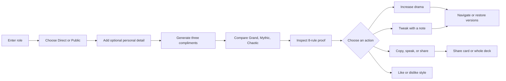
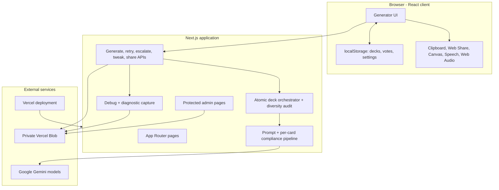
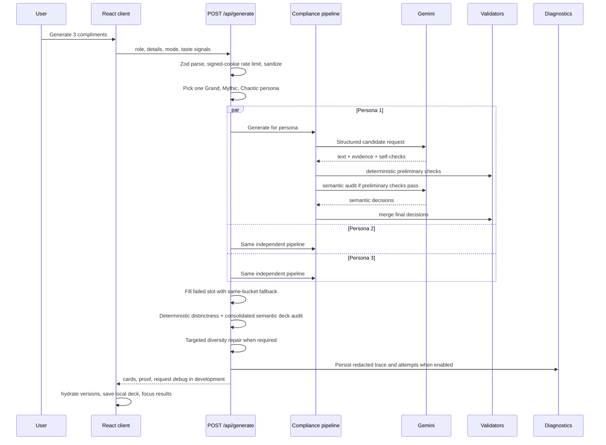
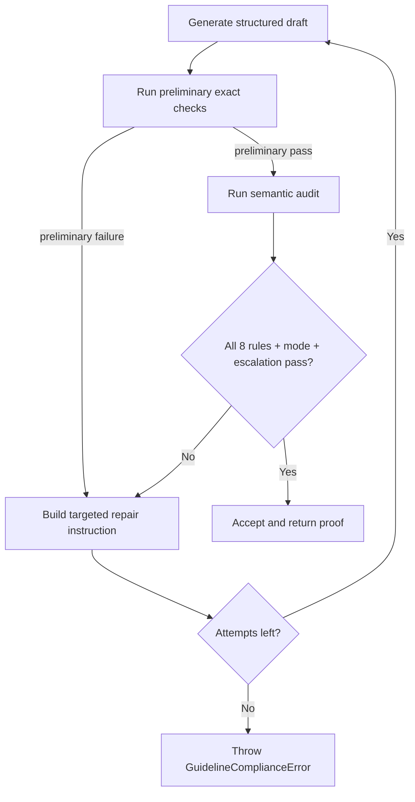
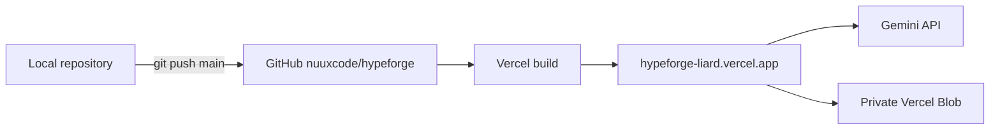

# HypeForge: Complete Product and Technical Guide

> Presentation handbook, architecture map, and operational runbook.
>
> **Code baseline:** current `main`, refreshed 2026-07-20 with the model-selection settings and generic key-pool naming.
> **Repository:** `https://github.com/nuuxcode/hypeforge`.
> **Production:** `https://hypeforge-liard.vercel.app/`

This document explains HypeForge at two levels:

1. **Product level:** what problem it solves, what a user sees, and how to demonstrate it without technical vocabulary.
2. **Engineering level:** what happens in the browser, server routes, Gemini calls, prompt construction, validation, repair, storage, diagnostics, tests, and deployment.

It is written so a presenter can answer both "What does this app do?" and "Which function rejects a weak escalation, where is the rejected draft stored, and how would you debug it?"

---

## 1. The Short Explanation

### One sentence

HypeForge turns a person's job or workplace function into three distinct, intentionally over-the-top compliments that are checked against eight company rules before they are shown.

### Thirty-second explanation

The user enters a role, optionally adds a personal detail, and chooses whether the compliment will be sent directly to the person or posted publicly. HypeForge asks Gemini to write three different voices: Grand, Mythic, and Chaotic. Every draft must mention the person's work, include an absurd metaphor and a made-up statistic, remain workplace appropriate, avoid appearance and public-figure comparisons, avoid the banned word "literally," and stay under 40 words. A card can then be copied, shared, read aloud, tweaked, or made more dramatic without changing the other cards.

### Two-minute product story

Most compliment tools produce one generic sentence. HypeForge treats praise as a small creative workflow:

1. Give it a real workplace function, such as "Customer Success Manager."
2. Choose **Direct** for a message written to the person, or **Public** for a post written about them.
3. Receive three independently generated voices, not three cosmetic rewrites of one answer.
4. Open the proof panel to see how all eight Brand Team rules were checked.
5. Pick a favorite and increase only that card's drama. Its history remains independent.
6. Tweak it with a note, copy it, hear it aloud, share it to a platform, download a PNG, or publish the whole deck with a short link.
7. If Gemini returns a bad draft, HypeForge rejects it, repairs it automatically, and preserves the last valid version.

The important product promise is not merely "AI writes text." It is **AI writes constrained text, the application verifies it, and the interface shows the result and its provenance.**

---

## 2. What Was Required and What Was Added

### Core exercise requirements

- Accept a job title or description.
- Generate three distinct compliments.
- Give each compliment a different persona or voice.
- Let the user make one card more dramatic without changing the other two.
- Preserve each card's own history.
- Provide copy and retry behavior.
- Use a real LLM API.

### Optional Company Guidelines addition

Every visible compliment must satisfy all eight rules from Brand Team v2.1:

1. No physical-appearance reference.
2. Reference the person's specific job title or function.
3. Include a wildly absurd metaphor or comparison.
4. Include one made-up statistic.
5. Maximum 40 words.
6. Ban the word "literally."
7. No comparison to a celebrity or real public figure.
8. Remain workplace appropriate.

The application must show which rules passed, and dramatic escalations must pass the same rules.

### Product extensions in this implementation

- Direct-message and public-post writing modes.
- Six-stage drama progression with per-card version navigation.
- Automatic rule repair with visible progress.
- Per-card tweak notes.
- Thumbs-up/down taste signals for future generations.
- Browser-local saved deck history.
- Short public deck links.
- Native sharing, X/LinkedIn/WhatsApp formatting, and PNG export.
- Text-to-speech read aloud.
- Light and dark themes, optional sound effects, reduced-motion support.
- Public compliment guide with research references.
- Development console explanations and a protected diagnostics dashboard.
- Gemini model fallback and multi-key rotation.

---

## 3. The User Journey



### Before generation

The page intentionally focuses on one main task: describe the person's work. The optional detail stays collapsed until requested. Direct mode is the default because most compliments are sent to the recipient.

### During generation

The browser sends one request to `/api/generate`. The server selects one persona from each voice bucket, then runs the three persona pipelines concurrently. The interface shows a three-card forge preview while the request is in flight.

### After generation

The heading becomes **Choose a favorite**. Each card contains:

- Bucket and persona identity.
- Drama stage and six-step progress meter.
- The compliment.
- An expandable eight-rule proof panel.
- A drama or retry action.
- Copy.
- Secondary tools for feedback, history, speech, tweaking, and sharing.

### When something fails

HypeForge distinguishes three situations:

- **Initial persona generation failed:** the server tries one same-bucket fallback. If any slot still fails, no partial deck is presented as success; the page shows one clear deck-level retry.
- **A mutation failed:** the previous valid card stays visible; the user can try again.
- **The entire deck failed:** the page shows a global error and a retry action.

This is fail-closed behavior: an invalid new draft is never substituted for a valid existing compliment.

---

## 4. Screen and Control Map

This section is the presenter-friendly answer to "What does every button do?"

### Header controls

| Control | User result | Code owner |
|---|---|---|
| HypeForge logo | Identifies the app; stays on the generator | `components/hypeforge-header.tsx` |
| Guide book icon | Opens the compact compliment guide dialog | `components/compliment-guide-dialog.tsx` |
| Saved/history icon | Opens browser-local saved decks and search | `components/deck-history-drawer.tsx` |
| Share icon | Publishes the current valid deck and opens native share or copies the URL | `components/hypeforge-header.tsx`, `app/api/share/route.ts` |
| Moon/sun icon | Switches light and dark theme | `components/hypeforge-header.tsx`, `app/globals.css` |
| Settings icon | Opens sound, proof-label style, and diagnostics entry point | `components/settings-dialog.tsx` |

The deck share icon appears only when at least one valid card exists.

### Input panel

| Control | Behavior |
|---|---|
| Their job or role | Required, 3-360 characters after server normalization |
| Direct | Writes to the recipient using "you" or "your" |
| Public | Writes about the recipient and rejects second-person wording |
| Add a personal detail | Reveals an optional 240-character detail field |
| Generate 3 compliments | Starts one deck request; disabled without a usable role |
| Example chips | Populate the role input without automatically submitting |
| Command/Ctrl + Enter | Keyboard generation shortcut from the role field |

### Deck-level controls

| Control | Behavior |
|---|---|
| New deck | Clears visible cards and active deck selection while retaining editable input |
| Global retry | Repeats generation after a deck-level failure |
| Share deck | Creates a short server-backed `/deck/<slug>` page |

### Card-level controls

| Control | Behavior | Important invariant |
|---|---|---|
| Down arrow in drama badge | Moves to the earlier saved version | It restores version text and state; it does not call Gemini |
| Up arrow in drama badge | Moves to the later saved version | Disabled until a later version exists |
| Rule proof panel | Expands eight checks, evidence, source, and word count | Proof comes from the server response |
| Make it more dramatic | Calls `/api/escalate` for this card only | Other cards do not change |
| Retry this card | Calls `/api/retry` with the same persona and subject | Used for a failed/empty card |
| Copy | Copies exactly the visible card text | Displays an announced "Copied!" state |
| Thumbs up | Adds or removes a positive taste signal | Clicking it twice clears it |
| Thumbs down | Adds or removes a negative taste signal | Switching from up to down replaces the vote |
| History | Opens this card's version list | Only one card subpanel is open at a time |
| Speaker | Starts/stops browser speech synthesis | Does not send audio or text to a server |
| Tweak sliders | Opens a note field and regenerates this card | Keeps the same drama level |
| Card share | Opens native/platform/PNG sharing options | Sharing is browser-side except deck links |

### Version history panel

- **Current** identifies the visible version.
- **Restore** is a real button with icon, border, hover, and focus state.
- **Read full** expands truncated text before restoration.
- Restoring an older version truncates the card's model conversation history at that point. The next escalation cannot see versions the user rewound away.
- Up to 50 rich UI versions are retained per card. The compact model conversation history sent to mutation routes is capped at 10 texts.

### Card share panel

- **Device share:** uses the Web Share API when supported; otherwise copies text.
- **Copy for X:** truncates safely to 280 characters and adds `#HypeForge`.
- **Copy for LinkedIn:** adds a context-sensitive lead and workplace hashtags.
- **Copy for WhatsApp:** uses lightweight WhatsApp formatting.
- **Download PNG card:** creates a 1200 x 1200 image in a browser canvas.

### Saved decks drawer

| Control | Behavior |
|---|---|
| Search | Searches role, persona names, current text, history, and rich versions |
| Deck row | Restores the entire deck into the workspace |
| Delete | Removes only that local deck |
| Clear saved decks | Removes all local deck history |
| Reset taste | Clears all stored up/down preferences |
| Compliment guide | Closes the drawer and opens the guide |
| Close/backdrop/Escape | Closes the drawer and restores focus |

### Settings

- **Sound effects:** toggles synthesized UI cues stored on this device.
- **Show check sources:** default proof headline, such as `5 in code - 3 by AI audit`.
- **Compact verified badge:** alternative headline; underlying checks do not change.
- **System diagnostics:** links to the protected `/admin` area.

### Public routes

- `/compliment-guide`: full standalone guide with practical examples and study links.
- `/deck/<slug>`: read-only public deck page with per-card proof.
- `/?share=<slug>`: imports a public deck into the local workspace.
- `/v2`: legacy redirect to `/`, preserving search parameters.

---

## 5. Architecture at a Glance



### Technology choices

| Layer | Choice | Why it fits |
|---|---|---|
| Framework | Next.js 16 App Router | One repository for interactive UI, server routes, metadata, and deployment |
| UI | React 19 + TypeScript + Tailwind 4 | Typed state and fast responsive styling |
| Icons | Lucide React | Consistent accessible icon vocabulary |
| LLM integration | Vercel AI SDK + `@ai-sdk/google` | Structured object output, timeouts, and Gemini provider support |
| Validation | Zod + deterministic TypeScript + Gemini semantic audit | Separates schema, exact rules, and meaning-based rules |
| Durable storage | Vercel Blob | Minimal serverless persistence for shares and diagnostics |
| Local persistence | Browser `localStorage` | No account required for personal decks and preferences |
| Tests | Vitest, Playwright, axe-core | Unit/API, browser, responsiveness, and accessibility coverage |
| Hosting | Vercel | Native Next.js runtime and automatic deploys from GitHub |

---

## 6. End-to-End Request Pipeline

### Initial generation sequence



### Step-by-step server behavior

1. Parse JSON.
2. Validate the request shape with Zod.
3. Read and increment the signed 24-hour rate-limit cookie.
4. Normalize user text, strip angle brackets, reject known prompt-injection phrases, and require workplace context.
5. Sanitize taste signals and keep only the three most recent likes and dislikes.
6. Randomly select one persona from each bucket, then shuffle card order.
7. Start all three persona pipelines concurrently and run each through compliance and targeted repair.
8. If a slot still fails, try one different persona from the same Grand, Mythic, or Chaotic bucket.
9. Require exactly three non-empty cards with eight passing checks. Anything less is a deck-level application failure, never partial success.
10. Compare accepted cards for duplicate text, opening, metaphor, statistic, or excessive token overlap.
11. Run one consolidated temperature-zero audit over the full deck for persona fit, imagery separation, pairwise semantic distinctness, and humor variety.
12. Regenerate only the card identified by deterministic or semantic feedback, with the other accepted texts supplied as explicit material to avoid. Audit and repair are bounded.

### Why three model candidates are separate

The current implementation makes **one candidate-generation call per persona**, in parallel. It does not ask one Gemini call to return all three compliments.

Benefits:

- A persona has a focused system prompt and one voice target.
- One malformed output can be repaired or replaced without corrupting the other candidates.
- Per-persona retries and diagnostics are easier to understand.
- All primary slots run concurrently, while the public success contract remains atomic.

Costs:

- More provider requests and higher token overhead.
- More opportunities for quota or provider failure.
- End-to-end latency follows the slowest persona pipeline.

A multi-candidate call would reduce request count, but it would couple all cards to one schema response, complicate per-card repair, and create a larger single failure domain. For this exercise, independence and debuggability were prioritized over minimum provider calls.

---

## 7. Gemini and Model Architecture

### Models

Defaults, all configurable through environment variables:

- Main generator: `gemini-3.1-flash-lite`.
- Backup generator: `gemini-3-flash-preview`.
- Semantic validator: main model unless `GEMINI_MODEL_VALIDATOR` overrides it.
- Validator temperature: `0`.
- Candidate temperature: normally `1`; first escalation uses `1.05`; repair attempts reduce to at most `0.75`.
- Thinking budget: disabled to favor low latency and predictable structured output.
- Provider timeout: 25 seconds by default.
- Candidate maximum output: 260 tokens.

In addition to the environment defaults, the private admin page offers a per-role model picker (writer, backup, judge) backed by a predefined allowlist in `lib/models.ts`. The admin's browser stores the choice locally and sends it with each request; the server honors an override only when the request carries a valid admin session cookie, accepts only allowlisted model ids, and falls back to the environment configuration otherwise.

There is **no embedded, local, or template fallback LLM**. Every newly generated compliment comes from Gemini. If Gemini and its configured fallbacks cannot produce a valid result, HypeForge reports a failure and keeps existing valid content rather than pretending a local template is AI output.

### Logical model-call count

A successful candidate normally requires:

1. One Gemini call to generate a structured candidate.
2. One Gemini call to semantically audit it, but only after preliminary checks pass.

Therefore a clean initial deck normally uses seven logical model calls: three generators, three per-card semantic audits, and one consolidated cross-card semantic audit. Per-card repair, same-bucket recovery, targeted diversity repair, model fallback, and key rotation can increase the physical provider-request count. The cross-card audit is a quality-enhancement call: if it alone remains unavailable after fallback, a deck may proceed only when all three cards passed the mandatory eight-rule pipeline and the deterministic diversity gate. The application never substitutes templates or a local LLM.

The semantic call is deliberately skipped when deterministic/evidence checks already fail. There is no reason to pay for a semantic judge when the draft is already known to violate an exact rule.

### Structured output contract

Gemini must return an object containing:

- `text`: the compliment.
- All eight claimed rule IDs.
- Exact evidence quotes for job function, absurd metaphor, and statistic.
- Self-check booleans for appearance, public-figure comparison, and workplace appropriateness.

The Zod schema is `GuidelineModelOutputSchema` in `lib/compliment-guidelines.ts`. The output is not trusted merely because Gemini claims success. Server code independently checks the object and text.

### Prompt layers

`lib/prompts.ts` builds four prompt types:

- **Persona system prompt:** persona name, voice, a few-shot example, safety constraints, all eight guidelines, and a structured-output instruction.
- **Initial request:** untrusted subject data, delivery mode, user taste signals, avoided compliments, and output requirements.
- **Escalation request:** prior turns plus an explicit demand to increase at least two dimensions of drama.
- **Tweak request:** prior turns plus a delimited untrusted note; company rules override the note.

User fields are placed inside a data block and described as untrusted. Angle brackets are stripped before interpolation so user text cannot close the delimiters.

### Persona system

There are eight personas across three buckets:

| Bucket | Personas |
|---|---|
| Grand | Distinguished Awards Committee, Startup Hype Deck, Overdramatic Theater Critic |
| Mythic | Epic Bard, Nature Documentary Narrator, Ancient Oracle |
| Chaotic | Overcaffeinated Hype Friend, Sports Commentator |

One persona is chosen from each bucket per deck. Each persona includes a short voice description, an assigned imagery domain, competing domains to avoid, and one compliant example written for a different role. The prompt explicitly forbids copying that example's opening, metaphor, statistic, content, or sentence pattern.

### Conversation memory

The server is stateless. The browser sends the current card text and compact history for escalation or tweaking. The server reconstructs a real role-based conversation:

1. System persona and guidelines.
2. Original user request.
3. Previous assistant compliment.
4. Neutral user transition.
5. Next assistant compliment.
6. Final escalation or tweak instruction.

This is stronger than pasting a text transcript into one prompt because the model receives the history in its native conversational roles. Hidden persona instructions remain server-side and are rebuilt from `personaId`.

---

## 8. The Validation System

### Important distinction

HypeForge does not have "one validator." It has a layered acceptance system:

1. **Structured-output validation** with Zod.
2. **Display-safety validation** for basic length, punctuation, and prompt leakage.
3. **Deterministic and evidence-based rule checks.**
4. **Independent Gemini semantic audit.**
5. **Delivery-mode quality gate.**
6. **Dramatic-escalation quality gate.**
7. **Deterministic deck-level distinctness checks.**
8. **One consolidated semantic deck audit for persona fit, imagery separation, and humor variety.**

### Eight-rule matrix

| Rule | Primary mechanism | What actually passes it |
|---|---|---|
| No appearance | Pattern guard + Gemini semantic audit | No detected appearance vocabulary, truthful model self-check, and semantic judge not false |
| Job/function | Exact evidence + subject-token grounding | Evidence occurs in text and connects to supplied work context |
| Absurd metaphor | Exact evidence + Gemini semantic audit | Evidence occurs in text and judge considers it wildly absurd |
| Made-up statistic | Numeric pattern + exact evidence + Gemini fictionality audit | A supported numeral-based statistic appears and reads as clearly invented rather than a plausible workplace KPI |
| Maximum 40 words | Deterministic word count | Count is 40 or fewer |
| No "literally" | Deterministic regex | Banned word absent |
| No public figure | Pattern guard + Gemini semantic audit | No explicit pattern, truthful self-check, and semantic judge not false |
| Workplace appropriate | Pattern guard + Gemini semantic audit | No unsafe pattern, truthful self-check, and semantic judge not false |

### Why not make all validation AI-based?

Rules such as word count and a banned word are exact. Using an LLM for them would be slower, more expensive, and less reliable than code. Evidence matching and numeric-pattern checks are also deterministic enough to keep in TypeScript.

Meaning-based rules need semantic judgment. A regex cannot reliably decide whether a metaphor is truly absurd, whether an unfamiliar name is a public figure, or whether phrasing is humiliating in context. Those checks use a temperature-zero Gemini audit.

The best architecture is hybrid:

- Code where the rule is objective.
- Exact evidence where the claim should be grounded.
- A semantic model where meaning matters.
- Tests around both layers to detect regressions and false positives.

Making every rule AI-based would reduce transparency and add correlated failure. Making every rule regex-based would create brittle false positives and false negatives.

### Two additional quality gates

These are not part of the official eight, so the UI should not count them as rule 9 or 10:

- `delivery-mode`: Direct must use second person; Public must not use second person.
- `dramatic-escalation`: the semantic judge must find the new version meaningfully more dramatic than the accepted baseline.

### Failure location data

Every rejected rule is converted to a `PipelineFailureDetail`:

- Rule key and human label.
- Plain reason.
- Location: exact fragment, missing element, or whole-output semantic judgment.
- Exact rejected fragment when one exists.
- Validator source.

That record powers console explanations and the admin dashboard.

---

## 9. Automatic Repair and Fail-Closed Behavior

### Attempt limits

- Generate, retry, and tweak: up to **2** compliance attempts per persona operation.
- Escalate: up to **3** attempts.

### Repair sequence



The repair instruction includes:

- The failed rule IDs and notes.
- The rejected draft.
- The accepted escalation baseline when relevant.
- Specific hints for statistics, job grounding, word count, or dramatic escalation.
- A different metaphor-domain request when cosmic imagery has become repetitive.

### Escalation progress in the UI

`/api/escalate` streams newline-delimited JSON (`application/x-ndjson`). The browser updates the same card through phases:

- Generating a stronger version.
- Checking all eight rules.
- Repairing automatically after a failed attempt.
- Showing attempt number and the checks being fixed.

The automatic-repair panel appears only after the first attempt misses something. The primary drama button itself communicates the normal loading state.

### What happens after all attempts fail

- The rejected draft is not shown as the new compliment.
- The last valid text and proof remain intact.
- The card receives a human-facing retry message.
- The API returns failure details and request ID.
- Development console logs explain the failure.
- Persistent diagnostics may capture the rejected structured output and evaluator reason.

---

## 10. Drama Progression and Version Semantics

### Six stages

| Level | Stage | Cue |
|---|---|---|
| 1 | Spark | The opening act |
| 2 | Amplified | Energy rising |
| 3 | Wild | Reality bending |
| 4 | Legendary | Myth in motion |
| 5 | Cosmic | Universal stakes |
| 6 | Maximum | Peak legend |

The UI cap is six. Mutation request schemas still accept levels up to 20 so older saved/shared decks do not break.

### Escalation is not "add more adjectives"

The escalation prompt requires at least two dimensions to increase:

- Scale.
- Stakes.
- Impossible consequences.
- Mock ceremony.
- Emotional intensity.

From level 3 onward, the prompt asks for a new metaphor category, broader consequences, and a new statistic. The semantic validator compares the new draft with the previous accepted text. If the difference is only a paraphrase, it fails `dramatic-escalation` and triggers repair.

### UI feedback

- Six-segment progress meter.
- Stage label and cue.
- Charging state on the next segment.
- Card-wide loading/power-up CSS states.
- Synthesized charge and level-up sound when enabled.
- Completion notice.
- One confetti burst only when level 6 is reached.
- Reduced-motion CSS suppresses decorative motion.

---

## 11. State and Persistence

### Browser state

The React page owns transient UI state:

- Form fields and delivery mode.
- Current cards.
- Loading and error state.
- Open drawer/dialog/subpanel IDs.
- Per-card tweak drafts.
- Text-to-speech state.
- Escalation progress.
- Copy/share status.

### `localStorage`

| Data | Key | Limit |
|---|---|---|
| Saved decks | `hypeforge_v2_deck_history` | 50 decks |
| Taste signals | `hypeforge_v2_taste_signals` | 30 signals |
| Active deck ID | `hypeforge_v2_active_deck` | One ID |
| Proof headline style | `hypeforge.proof-headline` | One setting |
| Sound setting | `hypeforge.sound-effects` | One setting |

Local storage failures are swallowed because history and settings are enhancements; they should not block generation.

### Taste behavior

The most recent three liked and three disliked compliments are sent as soft preference context on the next deck generation. The prompt says these are gentle direction, not templates, and forbids copying them.

Vote transitions:

- None -> Up: save positive.
- Up -> Up: clear.
- None -> Down: save negative.
- Down -> Down: clear.
- Up -> Down or Down -> Up: replace the signal.

### Shared deck storage

Production uses private Vercel Blob objects. The public page is a capability link: a random URL slug lets the server retrieve the private object and render it. Local development falls back to `.data/hypeforge-shares.json`.

Each share is normalized and validated again before storage. If proof is present, it must contain eight passing checks. Deck pages are `noindex` to avoid putting personal praise in search results.

Legacy long hash links are still readable and are imported into the new local workspace, but new shares use short slugs.

---

## 12. API Contracts

### `POST /api/generate`

Input:

```json
{
  "jobFunction": "Customer Success Manager",
  "personDetails": "calmed a difficult client call",
  "deliveryMode": "direct",
  "preference": { "liked": [], "disliked": [] }
}
```

Success returns `ok: true` with exactly three non-empty cards, each carrying eight passing v2.1 checks. A primary slot may recover through one same-bucket persona fallback, but an incomplete or semantically repetitive deck returns `ok: false` with deck diagnostics and no partial `cards` array.

### `POST /api/retry`

Rebuilds the hidden persona prompt from `personaId` and generates a fresh level-1 compliment. The route returns a one-item response history; the client records the result as a new `generated` version and appends it to the card's saved history.

### `POST /api/escalate`

Receives persona, sanitized subject fields, current text, history, delivery mode, and current drama level. It supports normal JSON or streamed NDJSON progress. Success increments drama level by one and appends history.

### `POST /api/tweak`

Receives the same card context plus a 3-240 character feedback note. Success keeps the current drama level and appends a `tweaked` version.

### `POST /api/share`

Validates one to three cards and creates a durable short slug. Success status is 201.

### `GET /api/share/[slug]`

Returns a normalized published deck or 404. The browser uses this when importing `/?share=<slug>`.

### `POST` and `DELETE /api/admin/session`

- POST verifies the admin code and writes a signed 30-day HTTP-only cookie.
- DELETE expires the cookie.

### HTTP status design

Malformed JSON/schema requests use 400 and missing server configuration can use 500/503. Many expected application failures, such as quota, rate limit, or a rejected compliment, intentionally return HTTP 200 with `ok: false`.

Reason: the UI can parse a complete structured response, show a controlled message, preserve valid content, and avoid opaque browser-level 502 errors.

Tradeoff: conventional APIs would use 422 for validation and 429 for rate limiting. If this became a public API, using semantic HTTP statuses plus the same structured body would be clearer for external clients.

---

## 13. Gemini Key Rotation and Model Fallback

### Key pool

The server reads a fixed ordered list of Gemini environment-variable names. Empty and duplicate values are removed. Key values never reach the browser or this document.

Behavior:

- Quota failure: rotate immediately.
- Credential failure: rotate immediately.
- Generic provider failure: record a streak; rotate after three consecutive failures on that key.
- Successful request: reset that key's failure streak.
- After rotation succeeds: log a recovery event.
- If every configured key fails: throw `GeminiKeyPoolExhaustedError` with redacted technical context.

The pool exists in server-process memory. In serverless deployment, different instances can have different active indices and streaks. This is resilience, not a globally coordinated quota scheduler.

### Model fallback

Candidate and semantic functions first try their selected model. If it fails, they try the configured backup model when it is different. Each model attempt itself uses the key pool.

Therefore there are two orthogonal fallback dimensions:

1. Rotate credentials.
2. Switch model ID.

### Security note

API keys are server-only environment variables. They are never prefixed with `NEXT_PUBLIC_`, never serialized into API responses, and are redacted from captured errors.

---

## 14. Observability and Diagnostics

### Three observability surfaces

1. **Server logs:** request IDs and structured events from every route.
2. **Development browser console:** plain-language request summary plus technical details.
3. **Protected `/admin`:** persistent grouped request traces and AI-attempt records.

### Request IDs

Every API route creates a UUID request ID. It connects:

- Browser console group.
- Server events.
- Provider failures.
- Rejected candidate attempts.
- Persistent admin records.

This is the primary debugging handle.

### Development console behavior

`lib/api-responses.ts` logs:

- Human action name, result, and elapsed time.
- Request reference and endpoint.
- Request payload.
- Response body.
- Server event table.
- Plain-English explanation.
- Failed rule names and definitions.
- Full rejected Gemini text and structured object when available.
- Exact fragment or missing/whole-output failure location.
- Validator, likely causes, fixes, and code locations.
- Link to `/admin?request=<request-id>`.

Production client logging is compiled to a no-op unless debug mode is explicitly enabled.

### Persistent records

When `HYPEFORGE_CAPTURE_AI_FAILURES=true`:

- Production writes private JSON objects to Vercel Blob.
- Local development writes NDJSON to `.data/hypeforge-ai-failures.ndjson` by default.
- API traces and AI attempts are stored separately but grouped by request ID in admin.
- Storage failure is non-blocking; a logging outage cannot break the compliment request.

AI-attempt records include:

- Prompt version and model IDs.
- Operation and persona.
- Delivery mode.
- Subject fingerprint and word count, not a separate raw subject field.
- Attempt number and outcome.
- Candidate structured output.
- Escalation baseline when relevant.
- Compliance result, failed rules, semantic notes, and failure locations.
- Redacted provider error and optional redacted stack.

Privacy nuance: even without a raw subject field, a rejected compliment can repeat a role or personal detail. The store is private and admin-protected, but retention and access policy would need formalization for production use.

### Admin dashboard

`/admin` requires a valid signed session and provides:

- Issues-only or all-request views.
- Counts for issues, provider failures, rejected drafts, and recovered attempts.
- Request grouping and direct request-ID filtering.
- Full candidate output with failed fragments highlighted.
- Human explanation, likely causes, repair steps, and source-code locations.
- Technical records and provider timeline.

`/admin/reference` is the searchable catalog of internal error keys such as `dramatic-escalation`, `made-up-statistic`, provider quota, malformed output, request timeout, and storage failures.

### Admin authentication

- Access code is verified with constant-time comparison.
- Invalid attempts receive a small fixed delay.
- Session token contains expiry plus HMAC signature, not the admin code.
- Cookie is HTTP-only, SameSite Strict, Secure in production, and valid for 30 days.
- Both a code of at least 8 characters and an independent session secret of at least 32 characters must be configured.

Do not put the admin code or API keys in source, screenshots, documentation, or client environment variables.

---

## 15. Security and Privacy Model

### Implemented controls

- Server-only Gemini credentials.
- Zod request and response schemas.
- Input length limits and normalization.
- Angle-bracket removal before XML-like prompt interpolation.
- Known prompt-injection phrase rejection.
- Hidden persona prompts reconstructed server-side.
- Output cleanup and prompt-leak phrase detection.
- Fail-closed guideline enforcement.
- Signed HTTP-only rate-limit cookie.
- HMAC-signed admin session.
- Secret redaction in logs.
- Private Blob storage.
- Content Security Policy.
- Frame denial, MIME sniffing denial, strict referrer policy, and disabled camera/microphone/geolocation.
- Shared deck pages marked `noindex`.

### Threat boundary

The browser is untrusted. It may alter card text, persona IDs, history, or delivery mode before calling an API. Server routes therefore:

- Revalidate request shapes.
- Resolve persona IDs against the server-owned registry.
- Rebuild hidden prompts.
- Clean current text and history.
- Validate existing text before mutation.
- Revalidate proof before publishing a share.

### Known security limitations

- The rate limiter is a signed per-browser cookie, not a distributed abuse-control service. Clearing cookies resets identity.
- Admin login has a delay but no dedicated distributed attempt limit.
- Public deck links are capability URLs with no expiry, owner deletion, or recipient authentication.
- Browser-local saved decks are readable by scripts running on the same origin.
- Gemini receives the job/function and optional detail because generation requires them.
- The semantic validator uses Gemini too, so generation and judgment are not provider-independent.

For a larger production system, use account or anonymous-device identity, Redis-backed quotas, CSRF protection, managed authentication/RBAC, explicit retention controls, delete/expiry for shares, and centralized tracing.

---

## 16. Deployment and Environment

### Deployment flow



The project is linked to Vercel as `hypeforge`. Vercel builds the Next.js application and injects production environment variables. Never print their values during a demo.

### Search and sharing metadata

`app/layout.tsx` owns the canonical URL, title template, description, keywords, Open Graph image, X/Twitter card, robots policy, and `WebApplication` JSON-LD. `app/robots.ts` allows public pages while excluding APIs, and `app/sitemap.ts` lists the generator and compliment guide. Dynamic shared decks receive their own title and description but remain `noindex` for privacy. This makes the product explainable to search and social crawlers without indexing recipient-specific deck content.

### Environment-variable groups

| Group | Variables | Purpose |
|---|---|---|
| Gemini key pool | `GEMINI_API_KEY` plus numbered backups `GEMINI_API_KEY_2` to `GEMINI_API_KEY_7` | Ordered server credentials |
| Legacy key | `HYPEFORGE_GEMINI_API_KEY` | Used only if the pool is empty |
| Models | `GEMINI_MODEL_MAIN`, `GEMINI_MODEL_BACKUP`, `GEMINI_MODEL_VALIDATOR` | Model selection |
| Timeout | `GEMINI_TIMEOUT_MS` | Provider timeout |
| Diagnostics | `HYPEFORGE_CAPTURE_AI_FAILURES`, `HYPEFORGE_DEBUG_STACKS` | Persistent records and optional stacks |
| Admin | `HYPEFORGE_ADMIN_CODE`, `HYPEFORGE_ADMIN_SESSION_SECRET` | Protected dashboard |
| Rate limit | `RATELIMIT_SECRET`, `DAILY_LIMIT` | Signed cookie and daily request cap |
| URL | `NEXT_PUBLIC_SITE_URL` | Canonical, sitemap, and social metadata |
| Blob | Vercel-provided Blob variables | Durable private shares and diagnostics |

### Local commands

```bash
cd hypeforge
pnpm install
pnpm dev
```

Open `http://localhost:3000/`.

Quality gates:

```bash
pnpm typecheck
pnpm lint
pnpm test
pnpm build
pnpm test:a11y
pnpm test:browsers
pnpm verify:api
pnpm eval:quality
```

Browser scripts use `HYPEFORGE_TEST_URL` and API verification uses `HYPEFORGE_VERIFY_URL` when testing a non-default target.

`eval:quality` sends a 36-case role corpus through the real generation endpoint and fails unless every case returns exactly three compliant cards with one voice from each bucket and basic lexical separation. `HYPEFORGE_EVAL_LIMIT` creates a fast smoke subset; `HYPEFORGE_EVAL_OUTPUT` preserves the per-case JSON report for review.

---

## 17. Testing Strategy

### Automated baseline

The automated baseline includes:

- The complete Vitest suite in `tests/`, including atomic-deck recovery and semantic-diversity repair.
- TypeScript, lint, and production build scripts.
- Playwright cross-browser checks for Chrome/Chromium, Firefox, and WebKit.
- Mobile and desktop widths.
- axe-core WCAG A/AA checks.
- Real endpoint verification script.
- A 36-case real-model quality corpus covering diverse roles, optional details, and both delivery modes.

### Test map

| Area | Representative coverage |
|---|---|
| API routes | Generate, retry, escalate, tweak, share |
| Guidelines | Every rule, evidence, word count, unsafe output |
| Repair | Retry limits, accepted/rejected candidates, escalation gate |
| Prompts | Role sequence, direct/public mode, injection framing, history |
| Personas | One per bucket |
| Distinctness | Duplicate text, opening, metaphor, statistic, token overlap |
| Semantic deck quality | Persona fit, imagery-domain separation, pairwise meaning, humor variety, targeted repair |
| Validation | Length, role context, injection phrases, angle brackets, tweak notes |
| Key pool | Key order, deduplication, quota/credential rotation, streak threshold |
| State | Deck history, restore truncation, votes, share legacy import |
| Sharing | Platform formatting and truncation |
| Diagnostics | Plain-language mapping, catalog, storage, admin auth |
| UX utilities | Clipboard, timeout fetch, drama cap, safe text |

### Browser checks

The cross-browser script verifies:

- Direct is selected by default.
- Public mode can be selected.
- A valid role enables generation.
- Settings and sound control are visible.
- Guide and dialogs close correctly.
- No horizontal overflow at 375 and 1440 widths.
- No browser console errors.

The accessibility script checks generator light/dark, settings, guide dialog, 320px mobile, standalone guide, and admin when credentials are supplied.

### Remaining human checks

- Physical iPhone/Safari behavior.
- Native share sheet on real mobile hardware.
- Speech voice quality varies by device.
- Sound and celebration feel in a real demo.
- Production diagnostics with intentionally induced provider failures should be handled carefully to avoid quota waste.

---

## 18. File-by-File Ownership Atlas

### Product pages

| Path | Responsibility | Start debugging here when... |
|---|---|---|
| `app/page.tsx` | Main client state and orchestration | A button calls the wrong action, state disappears, a deck restores incorrectly |
| `app/v2/page.tsx` | Legacy redirect | Old `/v2` links lose query parameters |
| `app/compliment-guide/page.tsx` | Public educational guide | Guide content, SEO, or navigation is wrong |
| `app/deck/[slug]/page.tsx` | Public read-only deck | A short share renders incorrectly or returns 404 |
| `app/layout.tsx` | Global metadata and JSON-LD | Canonical, OG, title, or structured data is wrong |
| `app/globals.css` | Design tokens, responsive layout, card/drama animation | Theme, clipping, motion, or layout regresses |

### Components

| Path | Responsibility |
|---|---|
| `components/v2-input-panel.tsx` | Role, mode, optional detail, examples, generate CTA |
| `components/v2-compliment-card.tsx` | Card rendering and all per-card controls |
| `components/hypeforge-header.tsx` | Header controls, sharing, theme, and dialog entry points |
| `components/loading-deck-preview.tsx` | Layout-stable three-voice generation preview and status copy |
| `components/guideline-proof.tsx` | Eight-rule proof disclosure |
| `components/deck-history-drawer.tsx` | Saved deck search/restore/delete and taste reset |
| `components/compliment-guide-dialog.tsx` | Compact in-app guide |
| `components/settings-dialog.tsx` | Sound/proof settings and admin link |
| `components/tooltip.tsx` | Portal-based hover/focus tooltips |

### API routes

| Path | Responsibility |
|---|---|
| `app/api/generate/route.ts` | Request validation, rate limiting, and the thin HTTP boundary for complete-deck generation |
| `app/api/retry/route.ts` | Fresh level-1 version for one persona |
| `app/api/escalate/route.ts` | Per-card escalation and NDJSON progress |
| `app/api/tweak/route.ts` | Per-card note-based rewrite |
| `app/api/share/route.ts` | Create short shared deck |
| `app/api/share/[slug]/route.ts` | Retrieve short shared deck |
| `app/api/admin/session/route.ts` | Sign in/out for diagnostics |

### AI and rules

| Path | Responsibility |
|---|---|
| `lib/prompts.ts` | Persona, initial, escalation, tweak, and history messages |
| `lib/personas.ts` | Persona registry, buckets, examples, selection |
| `lib/ai.ts` | Gemini structured generation, semantic audit, model fallback |
| `lib/gemini-key-pool.ts` | Credential selection, failure classification, rotation |
| `lib/compliant-generation.ts` | Attempts, validation merge, failure details, repair prompts |
| `lib/compliment-guidelines.ts` | Eight rules, schemas, patterns, exact verification |
| `lib/deck-generation.ts` | Concurrent slots, same-bucket recovery, atomic success, deck audits, targeted diversity repair |
| `lib/deck-distinctness.ts` | Cross-card duplicate checks |
| `lib/safeText.ts` | Model cleanup, display bounds, leak guard |
| `lib/zod-config.ts` | CSP-safe Zod JITless configuration; import before schemas |

### Client and persistence

| Path | Responsibility |
|---|---|
| `lib/api-responses.ts` | Type guards, friendly errors, development console diagnostics |
| `lib/client-fetch.ts` | Request timeouts and escalation stream reader |
| `lib/deck-history.ts` | Local deck/taste/active persistence and legacy share import |
| `lib/card-versions.ts` | Rich version migration, append, hydration, active version |
| `lib/card-sharing.ts` | Native/platform/PNG card sharing |
| `lib/forge-sound.ts` | User-triggered Web Audio cues |
| `lib/drama.ts` | Six stages, cap, button copy |
| `lib/proof-style.ts` | Local proof-heading preference |
| `hooks/use-compliment-speech.ts` | Browser speech lifecycle, stop behavior, and unsupported/error handling |

### Operations and security

| Path | Responsibility |
|---|---|
| `lib/debug.ts` | Request event recorder, redaction, trace scheduling |
| `lib/ai-failure-log.ts` | Blob/local observability persistence and listing |
| `lib/diagnostic-catalog.ts` | Human/technical error reference and source locations |
| `app/admin/page.tsx` | Grouped request diagnostics UI |
| `app/admin/reference/page.tsx` | Searchable diagnostic catalog |
| `lib/admin-auth.ts` | HMAC session and constant-time code verification |
| `lib/validate.ts` | Zod bodies, input sanitation, history/preferences limits |
| `lib/rateLimit.ts` | Signed daily client counter |
| `lib/shared-decks.ts` | Blob/local shared deck store |
| `next.config.ts` | Security headers and CSP |

---

## 19. Debugging Runbook

### First response to any reported problem

1. Reproduce it once without refreshing.
2. Record the visible message and action taken.
3. In development, expand the `[HypeForge Request]` console group.
4. Copy the request ID.
5. Open `/admin?request=<request-id>`.
6. Decide which layer failed: browser, request validation, rate limit, provider, structured output, company rule, quality gate, storage, or UI state.
7. Use the diagnostic's listed file and test location before changing prompts or patterns.

### Failure matrix

| Symptom | Likely layer | First files |
|---|---|---|
| Button does nothing | Client state/disabled condition | `app/page.tsx`, relevant component |
| Network timeout | Browser timeout or Gemini latency | `lib/client-fetch.ts`, `lib/ai.ts` |
| "Server configuration is missing" | Missing rate secret or Gemini config | `lib/rateLimit.ts`, `lib/gemini-key-pool.ts` |
| Quota message | All usable credentials/models exhausted | `lib/gemini-key-pool.ts`, provider events in admin |
| One empty card | Persona pipeline exhausted repairs | Generate route and that attempt's admin record |
| `made-up-statistic` | Numeric pattern/evidence mismatch | `lib/compliment-guidelines.ts` |
| `job-function` | Evidence not grounded in subject | `lib/compliment-guidelines.ts`, `lib/prompts.ts` |
| `dramatic-escalation` | Semantic judge says rewrite is not stronger | `lib/ai.ts`, `lib/prompts.ts`, `lib/compliant-generation.ts` |
| Direct text says "they" | Prompt quality; current code only enforces presence of you/your | `lib/prompts.ts`, `lib/compliant-generation.ts` |
| Public text says "you" | Deterministic delivery-mode gate | `lib/compliant-generation.ts` |
| Two cards feel the same | Distinctness threshold or persona prompt | `lib/deck-distinctness.ts`, `lib/personas.ts` |
| Restore then escalation sees removed future | History truncation regression | `app/page.tsx`, `lib/deck-history.ts` |
| Share link 404 | Blob config, slug, or missing local store | `lib/shared-decks.ts`, share APIs |
| Admin empty | Capture disabled, no records, or Blob config | `lib/ai-failure-log.ts` |
| Admin login loops | Cookie/session env mismatch | `lib/admin-auth.ts`, session route |
| Tooltip clipped/stuck | Portal positioning or focus/hover lifecycle | `components/tooltip.tsx` |
| Firefox CSP error from Zod | Missing first `zod-config` import | Any new schema module, `lib/zod-config.ts` |

### Fixing false validator decisions

Do not immediately weaken the validator. First classify the issue:

1. **Model wrote the wrong thing:** improve generation/repair prompt.
2. **Evidence is wrong:** improve structured-output instruction or exact evidence handling.
3. **Pattern misses a valid form:** add a narrow deterministic case and regression test.
4. **Pattern falsely matches:** narrow the pattern and add both positive and negative tests.
5. **Semantic judge is wrong:** add examples to its audit prompt, consider a second judge, or require agreement for ambiguous cases.
6. **Requirement itself is ambiguous:** document the product decision before changing code.

Every production issue should become a small redacted fixture or regression test. That is how prompt engineering becomes an engineering loop rather than manual guesswork.

---

## 20. Design Decisions and Tradeoffs

### Fail closed vs show the best available draft

**Decision:** reject any draft that misses a required rule.

Why: the exercise says all rules, every time. Showing a known-invalid compliment would make the proof misleading. The cost is occasional empty cards or retries.

### Hybrid validation vs one AI judge

**Decision:** combine code, evidence, guards, and semantic audit.

Why: exact rules belong in code; semantic rules need context. The cost is a more complex acceptance pipeline and source labeling.

### Three parallel personas vs one multi-candidate call

**Decision:** separate persona pipelines.

Why: independent retries, failures, voices, and diagnostics. The cost is more provider calls.

### Stateless server mutations vs server conversation sessions

**Decision:** send compact visible history and reconstruct prompts per request.

Why: works naturally in serverless deployment and avoids session storage. The cost is larger request bodies and trusting only revalidated visible history.

### Local personal history vs user accounts

**Decision:** local browser storage.

Why: instant, private-by-default, no sign-up. The cost is no cross-device sync, backup, or identity.

### Blob capability shares vs encoded URLs

**Decision:** short random slug backed by private Blob.

Why: readable links and room for card proof. The cost is server storage and lifecycle management.

### Friendly HTTP-200 errors vs semantic status codes

**Decision:** expected app-level AI failures use `ok: false` in a normal response.

Why: controlled UI and rich debug payload. The cost is less conventional API semantics.

### Same provider for generation and semantic audit

**Decision:** Gemini for both, with a separate temperature-zero call.

Why: simple stack and structured-output consistency. The audit is independent as a call and prompt, but not independent as a provider. A high-assurance version should consider a second provider or deterministic classifier for disputed semantic cases.

---

## 21. Known Limitations and a Production Roadmap

### Current limitations

- Semantic validation can still produce false positives or false negatives.
- Gemini generation and judgment share provider-family biases.
- A clean deck normally costs seven logical model calls, including the consolidated cross-card audit.
- Key rotation state is per warm server instance.
- Cookie rate limiting is not robust abuse prevention.
- Personal history is device-local and unauthenticated.
- Shared links do not expire and have no owner deletion UI.
- Diagnostics need formal retention and privacy policy.
- Admin is one shared secret, not multi-user RBAC.
- Web Share, TTS, Web Audio, clipboard, and downloaded fonts vary by browser.
- `app/page.tsx` still owns the main workflow state; header, loading preview, and speech lifecycle are already extracted, while card mutation orchestration could move into a dedicated reducer/hook if the product grows.
- Browser tests cover controls and layout but do not run expensive real Gemini generation in every engine.

### If scaling to a real company product

1. Add account or anonymous-device identity.
2. Move request quotas to Redis or a managed rate limiter.
3. Store decks in a database with ownership, deletion, and retention.
4. Add job queues, idempotency keys, and request cost budgets.
5. Add centralized OpenTelemetry traces and aggregate metrics.
6. Version prompts and rule documents in a managed registry.
7. Build a redacted evaluation dataset from rejected and accepted cases.
8. Run offline prompt/model evaluations before deployment.
9. Add a second semantic judge or consensus policy for ambiguous rules.
10. Add authenticated admin RBAC and audit logs.
11. Add share expiry, revocation, and content-reporting controls.
12. Split client orchestration into focused hooks and reducers.

---

## 22. Glossary

| Term | Meaning in HypeForge |
|---|---|
| Candidate | One structured draft returned by Gemini before acceptance |
| Persona | Server-owned voice configuration such as Epic Bard |
| Bucket | Grand, Mythic, or Chaotic voice family |
| Guideline proof | Eight server-produced rule checks shown beside a card |
| Deterministic check | A result computed by code, not interpreted by an LLM |
| Evidence check | A model-provided exact quote that server code verifies against output |
| Semantic audit | Separate Gemini call judging context-dependent rules |
| Quality gate | Required behavior outside the official eight, such as delivery mode |
| Fail closed | Reject uncertain/invalid output instead of displaying it |
| Repair attempt | New Gemini call containing specific failed checks and corrections |
| Baseline | Last accepted compliment used for escalation comparison |
| Distinctness | Cross-card checks preventing duplicate voice/content |
| Capability link | Random URL whose possession grants access to a shared deck |
| Request ID | UUID connecting browser, server, provider, and admin records |
| Logical model call | One generator or semantic-audit invocation before physical retries/fallbacks |

---

## 23. Source of Truth

When this guide and behavior disagree, the code and tests are authoritative. Start with:

- Product overview: `README.md`
- Requirement map: `COMPLIANCE.md`
- Verification record: `TESTING.md`
- Main client orchestration: `app/page.tsx`
- Header/loading/speech UI boundaries: `components/hypeforge-header.tsx`, `components/loading-deck-preview.tsx`, and `hooks/use-compliment-speech.ts`
- AI pipeline: `lib/compliant-generation.ts`
- Rules: `lib/compliment-guidelines.ts`
- Prompts: `lib/prompts.ts`
- Provider layer: `lib/ai.ts`
- Diagnostics: `lib/ai-failure-log.ts` and `lib/diagnostic-catalog.ts`
- Tests: `tests/`

Update the baseline commit at the top and revise affected sections whenever architecture or user behavior changes.
