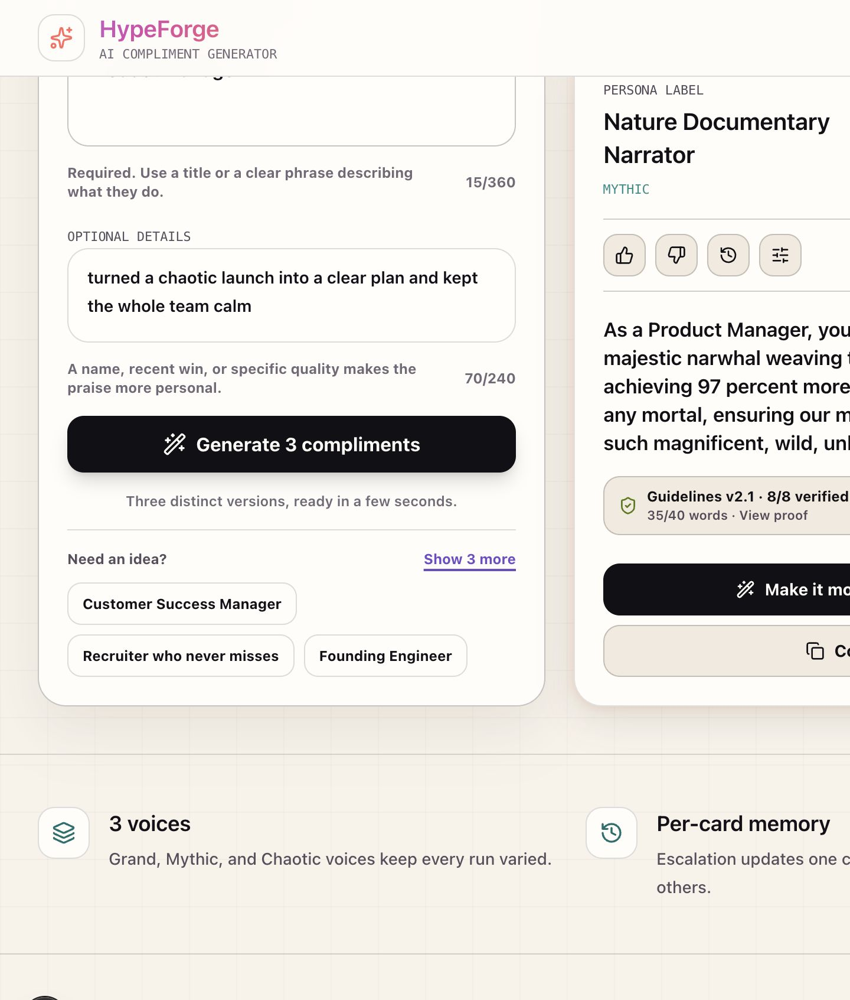

# HypeForge - AI Compliment Generator

Turns a job title or person description into three wildly enthusiastic, slightly unhinged compliments.

## Live Demo

[Open HypeForge](https://hypeforge-liard.vercel.app)



## Features

- Three distinct compliments at once, forced by one persona from each bucket
- Separate required workplace-function and optional person-details inputs
- Each card has independent conversation history
- "Make it more dramatic" escalates only the selected card, using its own prior versions, and caps at drama level 6 with a one-shot celebration
- Copy to clipboard with per-card confirmation and fallback copy support
- Intentional loading, friendly errors, and mobile-first layout
- Premium workspace with saved decks, per-card version history, tweak notes, and light taste signals
- Clean share links at `/deck/<short-id>` with a public, readable deck page
- Per-card native sharing, X/LinkedIn/WhatsApp copy formats, and downloadable 1200x1200 PNG cards
- User-triggered read aloud with the device's built-in speech synthesizer and an immediate stop control
- Crawlable compliment guide, metadata, Open Graph image, JSON-LD, `robots.txt`, and sitemap
- Company Compliment Guidelines v2.1 enforced across generation, retry, tweak, and escalation
- Per-version 8/8 rule proof with code, evidence, heuristic, and model check sources; the badge headline honestly splits code-verified from AI-audited checks, with a settings toggle for the wording
- Independent semantic validator for appearance, metaphor quality, public figures, workplace safety, and escalation quality
- Deck-wide duplicate, opening, metaphor, and statistic checks with targeted card regeneration

## Tech Stack

Next.js App Router, TypeScript, Tailwind CSS, server API routes, Vercel AI SDK, Gemini via `@ai-sdk/google`, Zod, Vercel Blob for durable production shares, Playwright, axe-core, and a signed HMAC cookie rate limit.

## Model Choice

Gemini 3.1 Flash-Lite (with a Flash backup and a temperature-0 validator pass), for three reasons: it is fast and free-tier friendly, so generating three compliments plus a compliance audit per request stays affordable; it supports structured output natively, so "exactly one compliment with exact rule evidence" is enforced by schema instead of hoped for; and the same family serves as an independent validator model, keeping the show-your-work audit on one provider. A full requirement-to-code map lives in [COMPLIANCE.md](./COMPLIANCE.md).

## Prompt Design

Each compliment is generated by a distinct comedic persona in its own model call. The app picks one Grand, one Mythic, and one Chaotic voice per run, and each persona's system prompt carries one few-shot example of its voice (written for a person who never appears in real input, with an explicit do-not-copy instruction) so the registers stay sharp. A deck validator then rejects exact duplicates, near-duplicate wording, repeated openings, repeated metaphors, and repeated statistics; only the conflicting card is regenerated with the accepted cards supplied as explicit wording to avoid.

Gemini returns a typed compliment plus exact role, metaphor, and fictional-statistic evidence. The server deterministically verifies the 40-word limit, banned word, evidence quotes, function grounding, statistic pattern, and conservative safety patterns. A separate validator-model call independently evaluates indirect appearance references, metaphor absurdity, public-figure comparisons, workplace safety, and whether escalation is meaningfully stronger. Generation gets one targeted repair; escalation gets at most two. Only outputs that pass every check reach the UI.

## Conversation State

Each card stores the current text, public compliment history, persona id, drama level, compliance proof, loading status, and copy state. Every saved version retains its own proof, so drama navigation, saved decks, and public shares keep the matching text and verification together. Escalation sends only that card's versions back to `/api/escalate`, and the server replays them to the model as a literal multi-turn conversation: the original request as a user turn, each prior compliment as an assistant turn, and the new escalation instruction as the newest user turn. Level 3 therefore builds on level 2 inside a real conversation instead of a pasted summary, and the tweak feature uses the same structure. The server rebuilds the persona/system prompt from `personaId`, so hidden instructions never ship to the browser and card histories cannot contaminate one another.

## Environment

```bash
cp .env.example .env.local
```

Set `HYPEFORGE_GEMINI_API_KEY` and `RATELIMIT_SECRET`. Set `NEXT_PUBLIC_SITE_URL` to the deployed public origin so canonical URLs, sitemap entries, and social metadata point to the real site. HypeForge has no local/internal text generator fallback; every compliment comes from Gemini. If Gemini quota is exhausted, the app shows a friendly error and logs the real provider details server-side. Keep `.env.local` out of git.

Shared decks use a local JSON store by default at `.data/hypeforge-shares.json`. On Vercel, connect a private Blob store and the app automatically uses `BLOB_STORE_ID`/`BLOB_READ_WRITE_TOKEN`; another host may use `HYPEFORGE_SHARE_STORE_PATH` on a persistent disk. Shared deck pages are intentionally `noindex`: they get good link previews without making a recipient's praise searchable.

## Run Locally

```bash
pnpm install
pnpm dev
```

Open http://localhost:3000. The old `/v2` path still works and redirects to the homepage, so previously shared links keep resolving.

## Checks

```bash
pnpm lint
pnpm typecheck
pnpm test
pnpm test:a11y
pnpm test:browsers
pnpm build
pnpm verify:api
```

## Sharing

The header share button creates a short URL such as `/deck/a1b2c3d4`, rather than placing the whole compliment deck in the address bar. The recipient can read it immediately or save a copy to their own HypeForge workspace. Each card also has a share panel for the device share sheet, platform-formatted clipboard text, and a locally rendered square PNG; compliment text never needs to be sent to another image service.

## AI-Assisted Development

Codex and Claude Code were used for implementation support, test generation, UI inspection, and debugging. Product decisions, prompt architecture, security boundaries, validation rules, and acceptance criteria were reviewed in the repository and verified with automated tests plus real Gemini and browser runs.

## Known Limitations

- Saved personal history and taste signals are local to one browser because the exercise intentionally has no account system.
- Semantic validation is probabilistic even though deterministic checks fail closed around it.
- The signed cookie rate limit is appropriate for a small exercise; a higher-traffic production service should use shared per-IP or account-based throttling.
- Safari coverage uses Playwright WebKit; the final deployed URL should also be checked on a physical iPhone before submission.
- Native share targets and text-to-speech voices depend on browser and operating-system support; unsupported actions fail back to copy or show a clear error.

## Future Improvement

The next improvement would be user-uploaded company guideline documents that compile into versioned validation rules and visible evidence, extending the same grounded, show-your-work architecture beyond the fixed Brand Team v2.1 document.

Detailed verification commands and coverage are in [TESTING.md](./TESTING.md).
